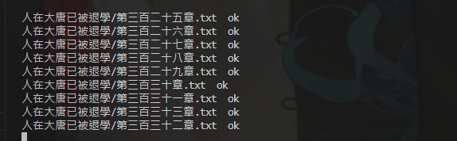
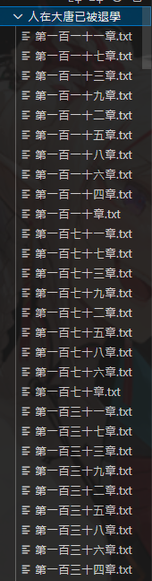
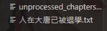

# goldhouse

注意，請不要過度爬蟲，ip會爆。

一般來說只用`goldhouse_normal.py`即可，如果要跑快點的話就使用`goldhouse_async.py`不過為了保險，一次只爬5個。

運行如下：

目錄如下

會生產出一個未搜尋到結果的txt檔，等第二round會去爬

爬完會刪除檔案，只留下書名這個folder。

目前已放進機器人中，有興趣的話可以進入討論
https://discord.gg/nh4SscAVXQ